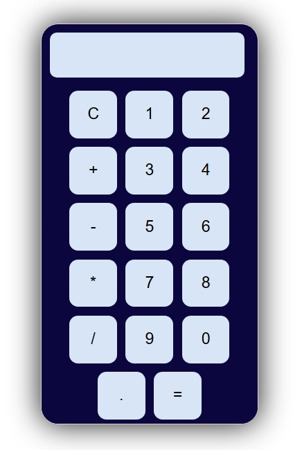

# Calculator

A functional calculator built using HTML5, CSS3, and JavaScript.

## About the Project

This project is a fully functional calculator that performs basic arithmetic operations, including addition, subtraction, multiplication, and division. It also supports decimal calculations and provides a simple, user-friendly interface.

The project was created to practice JavaScript fundamentals, DOM manipulation, event handling, and frontend development concepts while building a real-world interactive application.

## Project Preview

## Features

* Addition, subtraction, multiplication, and division operations
* Decimal number support
* Clear (C) button functionality
* Real-time display updates
* Interactive button-based input
* Simple and user-friendly interface
* Built using pure HTML, CSS, and JavaScript

## Technologies Used

* HTML5
* CSS3
* JavaScript

## Live Demo

🔗 Add your GitHub Pages link here

## Learning Outcomes

Through this project, I practiced:

* DOM manipulation
* JavaScript event handling
* Arithmetic logic implementation
* User interface design with CSS
* Frontend development fundamentals
* Interactive web application development

## Author

**Stuti Rai**

B.Tech in Artificial Intelligence & Data Science

GitHub: @stutirai
